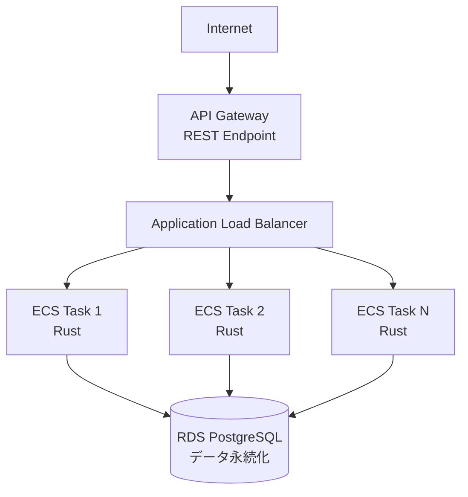

# 2 日で学べる Rust の API 設計とアーキテクチャ

## AWS デプロイ実践ガイド

---

## 📋 資料概要

**対象者**

- Rust の基礎構文を理解している開発者
- フロントエンド経験者でバックエンド学習中の方
- 実践的なAPI開発を学びたい方

**想定学習時間**: 総合 5 時間

- **Day 1**: 設計原則と API 実装（2.5 時間）
- **Day 2**: アーキテクチャと AWS デプロイ（2.5 時間）

**最終成果物**: AWS にデプロイされた Rust REST API

- ECS Fargate 上で実行
- RDS で永続化
- API Gateway で公開

---

## 🎯 全体アーキテクチャ

---

## 📚 ガイド構成

| ファイル                                                                       | 内容                                          |
| ------------------------------------------------------------------------------ | --------------------------------------------- |
| [01-day1-session1-design.md](./01-day1-session1-design.md)                     | Day1 セッション 1: クイック設計概論           |
| [02-day1-session2-architecture.md](./02-day1-session2-architecture.md)         | Day1 セッション 2: クリーンアーキテクチャ実装 |
| [03-day1-session3-implementation.md](./03-day1-session3-implementation.md)     | Day1 セッション 3: 実装実演                   |
| [04-day2-session1-aws-architecture.md](./04-day2-session1-aws-architecture.md) | Day2 セッション 1: AWS アーキテクチャ設計     |
| [05-day2-session2-docker.md](./05-day2-session2-docker.md)                     | Day2 セッション 2: Docker コンテナ化          |
| [06-day2-session3-ecs-deploy.md](./06-day2-session3-ecs-deploy.md)             | Day2 セッション 3: AWS ECS/Fargate デプロイ   |
| [07-day2-session4-monitoring.md](./07-day2-session4-monitoring.md)             | Day2 セッション 4: デプロイ検証と監視         |
| [08-reference.md](./08-reference.md)                                           | 実装リファレンス・CI/CD・チェックリスト       |
