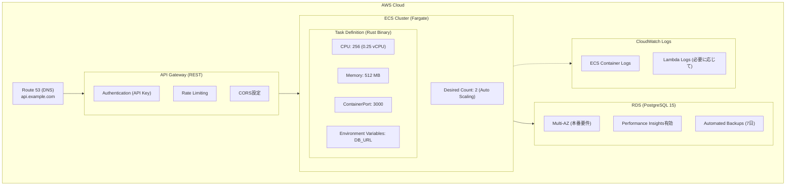

# Day 2: セッション 1 - AWS アーキテクチャ設計（30 分）

[← 前へ: Day1 セッション 3](./03-day1-session3-implementation.md) | [概要](./00-overview.md)

---

## 1.1 本番環境構成

---

## 1.2 コスト最適化のポイント

| リソース       | スペック                    | 月額コスト見積 |
| -------------- | --------------------------- | -------------- |
| ECS Fargate    | 0.25 vCPU × 512MB × 2 tasks | ~$15           |
| RDS PostgreSQL | db.t4g.micro (1 年契約)     | ~$25           |
| API Gateway    | 1M requests/月              | ~$3.50         |
| CloudWatch     | Logs retention 7 日         | ~$2            |
| **合計**       |                             | **~$45/月**    |

---

[次へ: セッション 2 - Docker コンテナ化 →](./05-day2-session2-docker.md)
