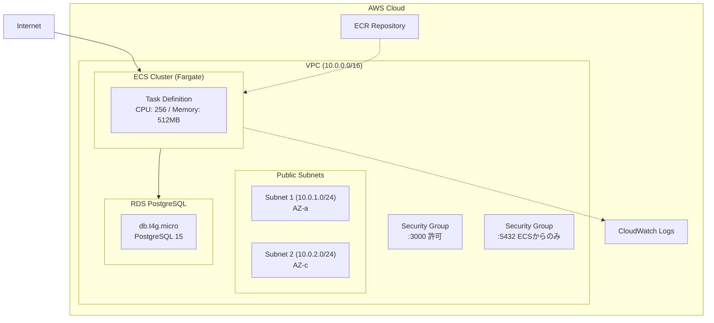

# Day 2: セッション 1 - AWS アーキテクチャ設計

[← 前へ: Day1 セッション 3](./03-day1-session3-implementation.md) | [概要](./00-overview.md)

---

## 1.1 本番環境構成



---

## 1.2 CloudFormation によるインフラ管理

### なぜ CloudFormation を使うのか？

| 手動 (AWS CLI) | CloudFormation (IaC) |
|----------------|----------------------|
| 再現性がない | テンプレートで何度でも同じ環境を作成 |
| 状態管理が困難 | スタックで状態を自動管理 |
| ロールバック不可 | 失敗時は自動ロールバック |
| ドキュメント化が別途必要 | テンプレート自体がドキュメント |

### スタック構成

本ガイドでは以下の 4 つのスタックに分割します：

```
infrastructure/cloudformation/
├── network.yaml    # VPC, Subnets, Security Groups
├── ecr.yaml        # ECR Repository
├── database.yaml   # RDS PostgreSQL
└── ecs.yaml        # ECS Cluster, Task Definition, Service
```

**分割の理由**:
- 各リソースに集中して学習できる
- 依存関係が明確になる
- 個別に更新・削除が可能

### デプロイ順序

スタック間には依存関係があるため、以下の順序でデプロイします：

```
1. network.yaml  → VPC, Subnets, Security Groups を作成
       ↓
2. ecr.yaml      → ECR Repository を作成
       ↓
3. database.yaml → RDS を作成（network の Export を参照）
       ↓
4. ecs.yaml      → ECS を作成（network, ecr, database の Export を参照）
```

---

## 1.3 コスト最適化（学習用最小構成）

| リソース | スペック | 月額コスト見積 |
|----------|----------|----------------|
| ECS Fargate | 0.25 vCPU × 512MB × 1 task | ~$7 |
| RDS PostgreSQL | db.t4g.micro | ~$12 |
| ECR | 3 イメージまで保持 | ~$0.10 |
| CloudWatch Logs | 3 日保持 | ~$0.50 |
| **合計** | | **~$20/月** |

> **注意**: 学習後は必ずスタックを削除してコストを抑えましょう。

---

[次へ: セッション 2 - Docker コンテナ化 →](./05-day2-session2-docker.md)
