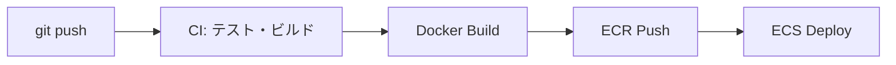

# Day 3: セッション 3 - GitHub Actions CI/CD

[← 前へ: セッション 2](./10-day3-session2-auth.md) | [概要](./00-overview.md) | [次へ: セッション 4 →](./12-day3-session4-api-gateway.md)

---

## 3.1 学習目標

- GitHub Actions の基本を理解する
- Rust プロジェクトの CI パイプラインを構築する
- ECR へのプッシュと ECS デプロイを自動化する

---

## 3.2 CI/CD の全体像



---

## 3.3 実装タスク

### Task 1: CI ワークフロー作成

**やること**: `.github/workflows/ci.yml` を作成

**要件**:
- `main` と `develop` ブランチへの push で実行
- `main` への PR で実行
- 以下のステップを順番に実行:
  1. コードフォーマットチェック
  2. 静的解析（Clippy）
  3. テスト実行
  4. リリースビルド

<details>
<summary>ヒント</summary>

- `on.push.branches` と `on.pull_request.branches` でトリガー設定
- `actions/checkout@v4` でリポジトリをチェックアウト
- `actions/cache@v4` で依存関係をキャッシュ（ビルド高速化）
- `cargo fmt --check` でフォーマットチェック
- `cargo clippy -- -D warnings` で警告をエラー扱い

</details>

<details>
<summary>コード例</summary>

```yaml
name: CI

on:
  push:
    branches: [main, develop]
  pull_request:
    branches: [main]

env:
  CARGO_TERM_COLOR: always

jobs:
  test:
    runs-on: ubuntu-latest

    steps:
      - uses: actions/checkout@v4

      - name: Install Rust
        uses: dtolnay/rust-action@stable

      - name: Cache cargo
        uses: actions/cache@v4
        with:
          path: |
            ~/.cargo/bin/
            ~/.cargo/registry/index/
            ~/.cargo/registry/cache/
            ~/.cargo/git/db/
            target/
          key: ${{ runner.os }}-cargo-${{ hashFiles('**/Cargo.lock') }}

      - name: Check format
        run: cargo fmt --check

      - name: Clippy
        run: cargo clippy -- -D warnings

      - name: Run tests
        run: cargo test

      - name: Build
        run: cargo build --release
```

</details>

---

### Task 2: CD ワークフロー作成

**やること**: `.github/workflows/deploy.yml` を作成

**要件**:
- `main` ブランチへの push でのみ実行
- AWS 認証を設定
- Docker イメージをビルドして ECR にプッシュ
- ECS サービスを更新（新しいイメージでデプロイ）

<details>
<summary>ヒント</summary>

- `if: github.ref == 'refs/heads/main'` で main のみに制限
- `aws-actions/configure-aws-credentials@v4` で AWS 認証（最新は v5 だが v4 も利用可能）
- `aws-actions/amazon-ecr-login@v2` で ECR ログイン
- `${{ github.sha }}` でコミットハッシュをタグに使用
- `aws ecs update-service --force-new-deployment` で再デプロイ

</details>

<details>
<summary>コード例</summary>

```yaml
name: Deploy to AWS

on:
  push:
    branches: [main]

env:
  AWS_REGION: ap-northeast-1
  ECR_REPOSITORY: user-api
  ECS_CLUSTER: user-api-cluster
  ECS_SERVICE: user-api-service

jobs:
  deploy:
    runs-on: ubuntu-latest
    if: github.ref == 'refs/heads/main'

    steps:
      - uses: actions/checkout@v4

      - name: Configure AWS credentials
        uses: aws-actions/configure-aws-credentials@v4
        with:
          aws-access-key-id: ${{ secrets.AWS_ACCESS_KEY_ID }}
          aws-secret-access-key: ${{ secrets.AWS_SECRET_ACCESS_KEY }}
          aws-region: ${{ env.AWS_REGION }}

      - name: Login to Amazon ECR
        id: login-ecr
        uses: aws-actions/amazon-ecr-login@v2

      - name: Build and push Docker image
        env:
          ECR_REGISTRY: ${{ steps.login-ecr.outputs.registry }}
          IMAGE_TAG: ${{ github.sha }}
        run: |
          docker build -t $ECR_REGISTRY/$ECR_REPOSITORY:$IMAGE_TAG .
          docker build -t $ECR_REGISTRY/$ECR_REPOSITORY:latest .
          docker push $ECR_REGISTRY/$ECR_REPOSITORY:$IMAGE_TAG
          docker push $ECR_REGISTRY/$ECR_REPOSITORY:latest

      - name: Deploy to ECS
        run: |
          aws ecs update-service \
            --cluster $ECS_CLUSTER \
            --service $ECS_SERVICE \
            --force-new-deployment
```

</details>

---

### Task 3: GitHub Secrets の設定

**やること**: GitHub リポジトリに AWS 認証情報を設定

**手順**:
1. GitHub リポジトリの **Settings** を開く
2. **Secrets and variables** → **Actions** を選択
3. **New repository secret** をクリック
4. 以下を追加:

| Secret 名 | 値 |
|----------|-----|
| `AWS_ACCESS_KEY_ID` | IAM ユーザーのアクセスキー |
| `AWS_SECRET_ACCESS_KEY` | IAM ユーザーのシークレットキー |

---

### Task 4: IAM ポリシー作成

**やること**: デプロイ用 IAM ユーザーに必要な権限を付与

**要件**:
- ECR へのプッシュ権限
- ECS サービスの更新権限
- 最小権限の原則に従う

<details>
<summary>ヒント</summary>

- ECR: `ecr:GetAuthorizationToken`, `ecr:PutImage` など
- ECS: `ecs:UpdateService`, `ecs:DescribeServices`
- Resource は可能な限り絞る

</details>

<details>
<summary>IAM ポリシー例</summary>

```json
{
  "Version": "2012-10-17",
  "Statement": [
    {
      "Effect": "Allow",
      "Action": [
        "ecr:GetAuthorizationToken",
        "ecr:BatchCheckLayerAvailability",
        "ecr:GetDownloadUrlForLayer",
        "ecr:BatchGetImage",
        "ecr:PutImage",
        "ecr:InitiateLayerUpload",
        "ecr:UploadLayerPart",
        "ecr:CompleteLayerUpload"
      ],
      "Resource": "*"
    },
    {
      "Effect": "Allow",
      "Action": [
        "ecs:UpdateService",
        "ecs:DescribeServices"
      ],
      "Resource": "arn:aws:ecs:ap-northeast-1:*:service/user-api-cluster/*"
    }
  ]
}
```

</details>

---

### Task 5: ブランチ保護ルール設定（オプション）

**やること**: main ブランチを保護して直接 push を禁止

**手順**:
1. **Settings** → **Branches** → **Add rule**
2. **Branch name pattern**: `main`
3. 以下をチェック:
   - Require a pull request before merging
   - Require status checks to pass before merging
   - Require branches to be up to date before merging

---

## 3.4 動作確認

```bash
# 新しいブランチで作業
git checkout -b feature/add-ci

# ワークフローファイルを追加
mkdir -p .github/workflows
# ci.yml と deploy.yml を作成

# コミット & プッシュ
git add .
git commit -m "Add CI/CD workflows"
git push origin feature/add-ci

# GitHub で PR を作成
# → CI が自動実行される

# PR をマージ
# → Deploy が自動実行される
```

---

## 3.5 学習ポイント

<details>
<summary>GitHub Actions の構造</summary>

```yaml
name: ワークフロー名

on:           # トリガー条件
  push:
    branches: [main]

jobs:         # ジョブ定義
  job-name:
    runs-on: ubuntu-latest
    steps:    # ステップ（順番に実行）
      - uses: actions/checkout@v4  # 既存アクション
      - run: echo "Hello"          # シェルコマンド
```

</details>

<details>
<summary>よく使うアクション</summary>

| アクション | 用途 |
|-----------|------|
| `actions/checkout` | リポジトリをチェックアウト |
| `actions/cache` | 依存関係のキャッシュ |
| `aws-actions/configure-aws-credentials` | AWS 認証設定 |
| `aws-actions/amazon-ecr-login` | ECR ログイン |

</details>

<details>
<summary>デプロイ戦略</summary>

| 戦略 | 説明 |
|------|------|
| Rolling | 順次置き換え（ECS デフォルト） |
| Blue/Green | 新旧環境を切り替え |
| Canary | 一部トラフィックで検証 |

</details>

---

## 3.6 トラブルシューティング

<details>
<summary>CI が失敗する場合</summary>

```bash
# ローカルで同じコマンドを実行
cargo fmt --check
cargo clippy -- -D warnings
cargo test
```

</details>

<details>
<summary>ECR プッシュが失敗する場合</summary>

```bash
# 認証確認
aws ecr get-login-password --region ap-northeast-1 | docker login --username AWS --password-stdin <account-id>.dkr.ecr.ap-northeast-1.amazonaws.com

# リポジトリ存在確認
aws ecr describe-repositories --repository-names user-api --region ap-northeast-1
```

</details>

<details>
<summary>ECS デプロイが失敗する場合</summary>

```bash
# サービス状態確認
aws ecs describe-services \
  --cluster user-api-cluster \
  --services user-api-service \
  --region ap-northeast-1

# タスク停止理由確認
aws ecs describe-tasks \
  --cluster user-api-cluster \
  --tasks <task-arn> \
  --region ap-northeast-1
```

</details>

---

## 3.7 完了チェックリスト

- [ ] `.github/workflows/ci.yml` を作成
- [ ] `.github/workflows/deploy.yml` を作成
- [ ] GitHub Secrets に AWS 認証情報を設定
- [ ] IAM ユーザーに必要な権限を付与
- [ ] PR 作成時に CI が実行されることを確認
- [ ] main マージ時にデプロイが実行されることを確認

---

[次へ: セッション 4 - API Gateway →](./12-day3-session4-api-gateway.md)
